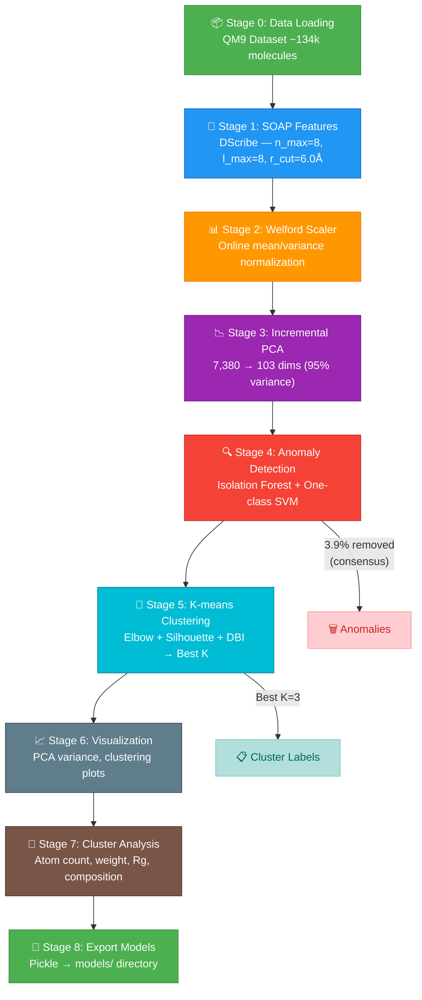

# Phân Loại Cấu Trúc Phân Tử  
### Molecular Structural Classification via Unsupervised Learning on SOAP Descriptors

---

## 1. Tổng Quan (Overview)

Dự án này triển khai một pipeline **học máy không giám sát** (unsupervised machine learning) để **phân loại và phân cụm cấu trúc hình học phân tử**.

**Mục tiêu khoa học**: Xây dựng một không gian cấu trúc (structural manifold) từ tập dữ liệu phân tử lý tưởng (QM9), sau đó sử dụng phương pháp phân cụm để nhận diện các nhóm cấu trúc hình học đặc trưng. Pipeline có khả năng mở rộng để so sánh cấu trúc lý tưởng (tính toán lượng tử) với cấu trúc thực nghiệm (nhiễu xạ tia X từ CCD), nhằm phát hiện các **sai lệch cấu trúc** (structural distortions) do:

- Dao động nhiệt (thermal B-factor vibrations)
- Hiệu ứng đóng gói tinh thể (crystal packing effects)
- Khuyết tật hình thái (missing atoms, incorrect hydrogen positions)

## 2. Cơ Sở Lý Thuyết (Theoretical Background)

### 2.1 Bộ mô tả SOAP (Smooth Overlap of Atomic Positions)

SOAP mã hóa cấu trúc cục bộ xung quanh mỗi nguyên tử dưới dạng phổ công suất (power spectrum) của mật độ nguyên tử lân cận. Mật độ nguyên tử tại vị trí **r** được xây dựng bằng cách đặt hàm Gaussian tại mỗi nguyên tử lân cận:

$$\rho(\mathbf{r}) = \sum_{i} \exp\left(-\frac{|\mathbf{r} - \mathbf{R}_i|^2}{2\sigma^2}\right) \cdot f_{\text{cut}}(|\mathbf{R}_i|)$$

Trong đó:
- $\sigma$ — độ nhòe Gaussian (Gaussian broadening width)
- $f_{\text{cut}}$ — hàm cắt mềm (smooth cutoff function) tại bán kính $r_{\text{cut}}$

Mật độ này được khai triển trên cơ sở hàm cầu (spherical harmonics) và hàm cơ sở xuyên tâm (radial basis):

$$\rho(\mathbf{r}) = \sum_{n=0}^{n_{\max}} \sum_{l=0}^{l_{\max}} \sum_{m=-l}^{l} c_{nlm} \cdot g_n(r) \cdot Y_{lm}(\hat{r})$$

Phổ công suất SOAP (bất biến quay) được tính bằng:

$$p_{nn'l}^{Z_1 Z_2} = \pi \sqrt{\frac{8}{2l+1}} \sum_{m=-l}^{l} (c_{nlm}^{Z_1})^* \cdot c_{n'lm}^{Z_2}$$

**Tham số sử dụng** (từ bài nghiên cứu):

| Tham số | Giá trị | Ý nghĩa |
|---------|---------|---------|
| $n_{\max}$ | 8 | Bậc khai triển cơ sở xuyên tâm |
| $l_{\max}$ | 8 | Bậc khai triển hàm cầu |
| $r_{\text{cut}}$ | 6.0 Å | Bán kính cắt (cutoff radius) |
| $\sigma$ | 1.0 Å | Độ nhòe Gaussian |
| Average | `inner` | Trung bình hóa trên tất cả nguyên tử → 1 vector/phân tử |

### 2.2 Chuẩn Hóa Welford (Online StandardScaler)

Thuật toán Welford cho phép tính mean và variance **trực tuyến** (online) qua từng batch, tránh tràn bộ nhớ:

$$\bar{x}_{n} = \bar{x}_{n-1} + \frac{x_n - \bar{x}_{n-1}}{n}$$

$$M_{2,n} = M_{2,n-1} + (x_n - \bar{x}_{n-1})(x_n - \bar{x}_{n})$$

$$\text{Var}(X) = \frac{M_2}{n-1} \quad \text{(Bessel's correction)}$$

### 2.3 Incremental PCA (SVD-based)

Phân tích thành phần chính gia tăng (Incremental PCA) qua phân rã giá trị đặc dị (SVD):

$$X = U \Sigma V^T$$

Giữ lại $k$ thành phần sao cho tổng phương sai giải thích ≥ 95%:

$$\frac{\sum_{i=1}^{k} \lambda_i}{\sum_{i=1}^{d} \lambda_i} \geq 0.95$$

Việc loại bỏ các thành phần cuối (trailing components) có tác dụng **khử nhiễu dao động nhiệt** (B-factor denoising) — đặc biệt quan trọng khi xử lý dữ liệu CCD thực nghiệm.

### 2.4 Phát Hiện Dị Thường (Anomaly Detection)

Hai phương pháp bổ trợ, chỉ loại mẫu bị **cả hai** phát hiện (consensus):

- **Isolation Forest**: Xây dựng cây ngẫu nhiên, điểm dị thường được cô lập bằng ít phân chia hơn → anomaly score thấp hơn.
  
- **One-class SVM**: Tìm siêu phẳng tối ưu trong không gian kernel (RBF) phân tách dữ liệu bình thường khỏi gốc tọa độ. Tham số $\nu$ kiểm soát tỷ lệ dị thường mong đợi.

### 2.5 Mini-batch K-means & Đánh Giá

**Tối ưu hóa K** qua 3 tiêu chí:

| Tiêu chí | Công thức | Mục tiêu |
|----------|-----------|----------|
| **WCSS** (Elbow) | $\sum_{k} \sum_{x \in C_k} \|x - \mu_k\|^2$ | Tìm điểm "khuỷu tay" |
| **Silhouette** | $s(i) = \frac{b(i) - a(i)}{\max(a(i), b(i))}$ | Maximize (−1 đến +1) |
| **DBI** | $\frac{1}{K}\sum_{i=1}^{K}\max_{j \neq i}\frac{\sigma_i + \sigma_j}{d(\mu_i, \mu_j)}$ | Minimize |

## 3. Dữ Liệu (Datasets)

### QM9 — Đa Tạp Cơ Sở (Baseline Manifold)

| Thuộc tính | Giá trị |
|-----------|---------|
| Nguồn | [Quantum-Machine.org](https://quantum-machine.org/datasets/) |
| Số phân tử | ~134,000 |
| Nguyên tố | C, H, O, N, F |
| Nguyên tử tối đa | 29 (≤9 nguyên tử nặng) |
| Trạng thái | Lý tưởng (chân không, 0K, tối ưu DFT/B3LYP/6-31G(2df,p)) |
| Định dạng | XYZ (tọa độ Descartes) |

### CCD — Dữ Liệu Thực Nghiệm (mở rộng)

| Thuộc tính | Giá trị |
|-----------|---------|
| Nguồn | Chemical Component Dictionary (PDB) |
| Phương pháp | Nhiễu xạ tia X (X-ray crystallography) |
| Đặc điểm | Chứa nhiễu: dao động nhiệt, đóng gói tinh thể, khuyết tật |

## 4. Pipeline



> Tất cả các stage đều xử lý theo **batch** qua HDF5 chunked I/O và `partial_fit` APIs, đảm bảo khả năng chạy trên Kaggle (16-30GB RAM). Hệ thống **checkpoint** cho phép resume từ stage cuối cùng hoàn thành.

## 5. Kết Quả (Results)

| Metric | Giá trị |
|--------|---------|
| Kích thước SOAP | 7,380 chiều |
| Sau PCA | 103 thành phần (95% variance) |
| Tỷ lệ giảm chiều | 98.6% |
| Dị thường loại bỏ | 5,220 (3.9% — consensus) |
| Dữ liệu sạch | 128,665 mẫu |
| K tối ưu | 3 cụm |
| Silhouette Score | 0.1520 |
| Davies-Bouldin Index | 2.4355 |

## 6. Cài Đặt & Sử Dụng

### Trên Kaggle (khuyến nghị)
1. Tạo Python Notebook tại [kaggle.com](https://www.kaggle.com)
2. Bật **Settings → Internet → ON**
3. Copy `kaggle_notebook.py` vào cell → **Run All**
4. Test nhanh: `MAX_MOLECULES = 5000` (~5 phút)

### Local
```bash
git clone https://github.com/minhduc110207/Structure-clustering.git
cd Structure-clustering
pip install -r requirements.txt
python kaggle_notebook.py
```

### Sử dụng model đã train
```bash
# Demo
python predict.py --demo

# Phân loại 1 phân tử
python predict.py molecule.xyz

# Phân loại thư mục
python predict.py my_molecules/
```

## 7. Cấu Trúc Dự Án

```
Structure-clustering/
├── kaggle_notebook.py     # Pipeline chính (8 stages + checkpoint)
├── predict.py             # Inference với pre-trained models
├── export_models.py       # Export utility
├── test_pipeline.py       # Test suite (11 test cases)
├── requirements.txt       # Dependencies
├── models/                # Pre-trained models (~25 MB)
│   ├── scaler.pkl
│   ├── ipca.pkl
│   ├── kmeans.pkl
│   ├── isolation_forest.pkl
│   ├── ocsvm.pkl
│   └── config.json
├── README.md
├── LICENSE                # MIT
└── .gitignore
```

## 8. Tài Liệu Tham Khảo

1. Bartók, A. P., Kondor, R., & Csányi, G. (2013). On representing chemical environments. *Physical Review B*, 87(18), 184115. — **SOAP descriptor**
2. Himanen, L., et al. (2020). DScribe: Library of descriptors for machine learning in materials science. *Computer Physics Communications*, 247, 106949. — **DScribe library**
3. Ramakrishnan, R., Dral, P. O., Rupp, M., & von Lilienfeld, O. A. (2014). Quantum chemistry structures and properties of 134 kilo molecules. *Scientific Data*, 1, 140022. — **QM9 dataset**
4. Liu, F. T., Ting, K. M., & Zhou, Z. H. (2008). Isolation Forest. *ICDM*, 413–422. — **Isolation Forest**
5. Schölkopf, B., et al. (2001). Estimating the support of a high-dimensional distribution. *Neural Computation*, 13(7), 1443–1471. — **One-class SVM**

## 9. License

MIT License — xem file [LICENSE](./LICENSE).
